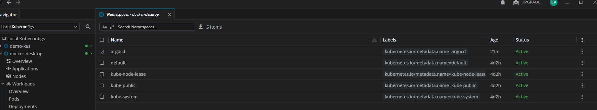
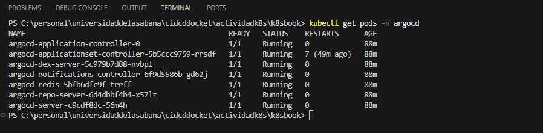
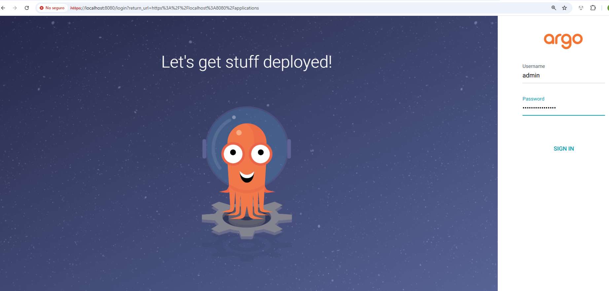

# PRUEBA PERSONAL K8S

## Descripción: 

El trabajo involucra la creación de microservicios individualmente desplegables, utilizando 
contenedores Docker, un orquestador de contenedores como Kubernetes y herramientas 
como Helm para la gestión de paquetes y configuraciones.  
Pasos:  
Trabaje con un microservicio básico. Diseñar los contenedores Docker para el microservicio 
incluyendo la configuración necesaria.  
Despliegue con Helm:  
Crear charts de Helm el microservicio, especificando los valores y configuraciones 
necesarias.  
Utilizar valores por defecto y overrides para personalizar las configuraciones según el 
entorno.  
Implementación de ArgoCD:  
Desplegar ArgoCD en el clúster de Kubernetes.  
Configurar repositorios Git como fuentes de definición de la aplicación.  
Definir aplicación en ArgoCD para el microservicio, utilizando los charts de Helm.  
Automatización con Pipelines:  
Cree los pipelines necesarios para desplegar el aplicativo en el momento de detectar un 
commit sobre la rama que configure, Configurando pipelines de CI/CD para automatizar el 
proceso de construcción y despliegue del microservicio.  
Acá pondrá en práctica:  
Docker  
Kubernetes  
Herramienta de CI que escoja  
ArgoCD  
Helm 

### Inicializar el proyecto (crea el archivo package.json)
    npm init -y

### Instalar Express (para variables de entorno)

    npm install express 

###	Construir la imagen:
       docker build -t mi-api-node .

###	Correr el contenedor:
       docker run -p 3000:3000 mi-api-node

###    Instalacion de Helm
       https://github.com/helm/helm/releases
       Se busca el del SO
       PAra el caso de Windows se toma el binario y se recomienda renombrarlo por un nombre mas corto 
       carpeta sujerida c:\bin, se debe adicionar esa ruta a la variable de entorno PATH de Windows.

       Luego se ejecuta la sentencia helm.exe y sus opciones para generar la estructura de yml


###    Instalacion de Argo CD
       https://github.com/argoproj/argo-cd/releases
       Se busca el del SO       
       PAra el caso de Windows se toma el binario y se recomienda renombrarlo por un nombre mas corto
       carpeta sujerida c:\bin , la cual ya esta declarada en el path del SO.
       Se pasa a crear el namespace en Kubernetes 
          Commando: 
             1. Crear el namespace argocd
                 kubectl create namespace argocd

             2. Aplicar el manifiesto de instalación de ArgoCD
                 kubectl apply -n argocd -f https://raw.githubusercontent.com/argoproj/argo-cd/stable/manifests/install.yaml

          Imagen desde Lens validando su creacion
          
          
          Pasos post-instalación:
              - Verificar componentes            : kubectl get pods -n argocd
                
              - Obtener contraseña inicial       : el usuario siempre es admin
                  Para Linux = kubectl -n argocd get secret argocd-initial-admin-secret -o jsonpath="{.data.password}" | base64 -d
                  Para Windows:  $pass = kubectl -n argocd get secret argocd-initial-admin-secret -o jsonpath="{.data.password}"
                                 [System.Text.Encoding]::UTF8.GetString([System.Convert]::FromBase64String($pass))

                 Clave: Awa2DGOVK2JefAlo

              - Acceder a la interfaz            : Ejecuta kubectl port-forward svc/argocd-server -n argocd 8080:443 y abre https://localhost:8080
                   


   ### Estructura del proyecto

         ```                

         \---k8sbook
    |   .dockerignore
    |   application.yaml
    |   Dockerfile
    |   index.js
    |   package-lock.json
    |   package.json
    |   README.md
    |   
    +---.github
    |   \---workflows
    |           docker-image.yml
    |           
    +---charts
    |   \---mi-app
    |       |   Chart.yaml
    |       |   values.yaml
    |       |   
    |       \---templates
    |               deployment.yaml
    |               service.yaml
    |               _helpers.tpl
    |               
    +---docs
    |   \---images
    |           argocd_exponerport.png
    |           argocd_login.png
    |           argocd_namespace.png
    |           argocd_pods.png
    |           
    \---src
            index.js
            


